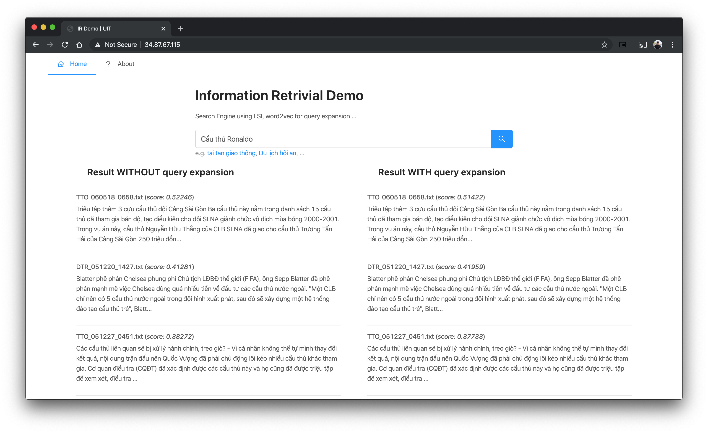

# information-retrieval-lsi

## Installation

### Download resources

- Download model: https://drive.google.com/file/d/108JWlBEAdd1Qrmmvr5ha3EOgt1cpKEgr/view?usp=sharing
    - Place the models at `backend/model`

- Download data: https://www.dropbox.com/s/xclufsrvvdkyaac/news_dataset.7z?dl=0
    - Place the data at `backend/news_dataset`


### Install libs

- Python3 pls
- Nodejs 10 pls
- Good luck

```bash
pipenv shell
pipenv install

cd frontend
yarn
```

## Run

1. Backend
    ```
    FLASK_APP=backend/app.py falsk run
    # http://localhost:5000
    ```

2. Frontend
    ```
    API_HOST=http://localhost:5000 yarn dev
    # http://localhost:3000
    ```

